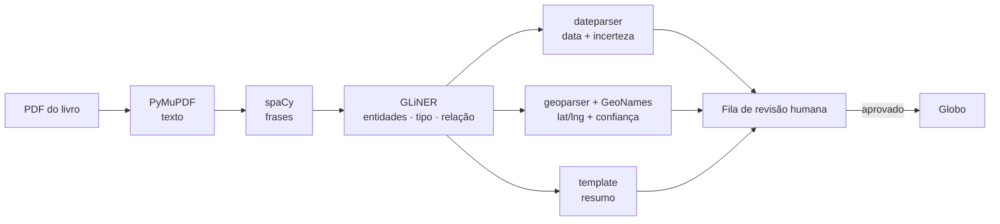

# Globo Histórico Interativo

Um globo terrestre navegável onde acontecimentos históricos aparecem como
pontos clicáveis — e um pipeline que lê livros de história em PDF para
alimentá-lo, sem inventar um único fato.


---

## A ideia

Linha do tempo de livro didático é uma lista. O que aconteceu em 1453 aparece
perto do que aconteceu em 1455, e o fato de um ter sido em Constantinopla e o
outro em Lisboa se perde — junto com a razão pela qual um causou o outro.

A ideia aqui é inverter isso: **colocar a história no espaço primeiro, e no
tempo depois.** O globo é o eixo principal, a timeline é um filtro. Você
aproxima de uma região, arrasta o intervalo de anos, e vê o que aconteceu ali —
não o que aconteceu naquele ano no mundo inteiro.

Isso levanta um problema de dados. Um mapa histórico só é interessante com
volume, e volume não se digita à mão. A fonte natural são livros de história —
que existem em PDF, em texto corrido, sem estrutura nenhuma.

Daí o projeto ter duas metades:

| Metade | O que faz |
|---|---|
| **Frontend** | O globo, a navegação hierárquica e a timeline |
| **Ingestão** | Lê o PDF do livro e transforma texto corrido em eventos com data, coordenada e resumo |

---

## Estado atual

**Frontend** — React + [react-globe.gl](https://github.com/vasturiano/react-globe.gl),
hoje com 10 eventos de exemplo em `src/data/events.json`.

- Globo com tiles da NASA GIBS (relevo e batimetria; o detalhe cresce com o zoom)
- Marcadores SVG coloridos por categoria, com tamanho proporcional à importância
- **Navegação hierárquica** mundo → continente → país → estado, filtrando eventos
  por nível de importância (5 / 4 / 3 / 1) e por recorte geográfico
- Timeline de duas alças, com faixas por era
- Busca por evento, local ou ator, com voo de câmera até o ponto
- Painel de resumo ao clicar num evento

**Ingestão** — passo 1 do pipeline implementado e medido contra dois livros
inteiros. Detalhes em [`ingestao/README.md`](./ingestao/README.md).

---

## Como a IA funciona

> Documentação completa em [`IA.md`](./IA.md).

### A decisão que define o resto: nenhum LLM generativo

O projeto **não usa** GPT, Claude, Llama nem qualquer modelo gerador de texto no
núcleo da extração. Isso não é preciosismo — decorre de quatro restrições, em
ordem de prioridade:

1. **Não alucinar.** Não inventar evento, data ou lugar que não está no texto.
2. Rodar **local e offline** quando preciso.
3. **Não depender de API** de terceiro.
4. **Custo baixo** — o custo vira hardware e tempo, não requisição por página.

A primeira restrição é a que decide. Um modelo generativo produz texto novo, e
texto novo pode ser plausível e falso ao mesmo tempo — exatamente o modo de
falha inaceitável num mapa histórico.

A alternativa são **modelos encoder que fazem predição de span**: em vez de
gerar texto, eles apontam trechos que já existem e os etiquetam. Um modelo que
só sabe dizer *"os caracteres 412 a 429 são um nome de lugar"* **não consegue
fabricar um fato** — no máximo erra o rótulo de um trecho real. O erro fica
verificável, porque o trecho original está sempre junto.

### A tarefa, quebrada

| # | Subtarefa | Dificuldade | Ferramenta |
|---|---|---|---|
| 1 | PDF → texto limpo | fácil | PyMuPDF *(não é IA)* |
| 2 | Segmentar em frases e parágrafos | fácil | spaCy |
| 3 | Reconhecer entidades e tipo de evento | média | **GLiNER** (zero-shot) |
| 4 | Ligar entidades num evento estruturado | **difícil** | GLiNER (relação) + regras |
| 5 | Lugar → coordenada, desambiguando | **difícil** | geoparser + GeoNames local |
| 6 | Normalizar data com incerteza | média | HeidelTime / dateparser |
| 7 | Resumir sem inventar | média | template sobre os campos extraídos |
| 8 | Revisão humana com proveniência | processo | fila de aprovação |

Os passos 1, 2, 6, 7 e 8 são engenharia comum. A dificuldade real está em
**3, 4 e 5**.

### O pipeline



### Por que GLiNER

[GLiNER](https://github.com/urchade/GLiNER) é um encoder pequeno, no espírito do
BERT, que faz **NER zero-shot**: as categorias são declaradas em tempo de
execução — `["batalha", "tratado", "cidade", "pessoa", "data", "obra"]` — sem
treino e sem dataset rotulado.

Na prática isso significa que mudar o recorte histórico é mudar uma lista de
strings, não montar um conjunto de treinamento. E o modelo roda em **CPU comum**:
`urchade/gliner_multi-v2.1`, 1,16 GB, licença Apache-2.0.

### O que foi medido

Passo 1 rodado contra **dois livros de história completos**:

| Métrica | Livro A | Livro B |
|---|---|---|
| Candidatos gerados | 1099 | 954 |
| **Proveniência íntegra** | **1099/1099 (100%)** | **954/954 (100%)** |
| Data normalizada (passo 6) | 168 (15%) | 237 (25%) |
| Resumo gerado (passo 7) | 294 (27%) | 265 (28%) |
| Completos (campos mínimos) | 15 (1,4%) | 13 (1,4%) |

A garantia central se sustenta em escala: **100% de proveniência íntegra em 2053
candidatos reais** — nenhum span apontou para trecho que não existia. É a
propriedade que justifica a arquitetura inteira.

A completude de **1,4% é baixa**, e está registrada aqui de propósito. Num
parágrafo sintético de teste o número foi 80%; contra livro real, despencou. A
diferença mede o quanto texto corrido de verdade é mais difícil que exemplo
montado — e é o problema aberto que o passo 4 precisa resolver.

Desempenho sem GPU: **~8 s por página** em CPU.

### Nada vai pro globo sem revisão

Todo candidato extraído entra numa **fila de aprovação** (`ingestao/revisar.py`)
com o trecho-fonte ao lado. Um humano confirma antes de o evento existir no
mapa. A extração automática propõe; ela não publica.

---

## Rodando o frontend

```bash
npm install
npm run dev     # http://localhost:5173
npm run build   # typecheck + build de produção
```

## Rodando a ingestão (opcional)

Exige **Python ≥ 3.10** — o Python 3.9 que vem no macOS não serve, é exigência
do `gliner`.

```bash
cd ingestao
python3.12 -m venv .venv
./.venv/bin/pip install -r requirements.txt

./.venv/bin/python spike_passo1.py          # extrai e mede contra gabarito
./.venv/bin/python -m unittest testes       # rápido, não carrega o modelo
COM_MODELO=1 ./.venv/bin/python -m unittest testes
```

A primeira execução baixa o modelo `urchade/gliner_multi-v2.1` (1,16 GB); o
venv ocupa cerca de 940 MB.

---

## Documentação

| Documento | Conteúdo |
|---|---|
| [`ARQUITETURA.md`](./ARQUITETURA.md) | Visão geral, stack, modelo de dados, roadmap |
| [`VISUAL.md`](./VISUAL.md) | Direção visual, marcadores, navegação, nível de detalhe |
| [`IA.md`](./IA.md) | Pipeline de extração em detalhe, decisões e alternativas descartadas |
| [`ingestao/README.md`](./ingestao/README.md) | Como rodar e medir a ingestão |

---

## Dados externos

Nada é baixado no build — tudo vem de fontes abertas, em tempo de execução:

| Dado | Fonte | Licença |
|---|---|---|
| Tiles do globo | NASA GIBS (`BlueMarble_ShadedRelief_Bathymetry`) | domínio público |
| Fronteiras de países e estados | Natural Earth (via `nvkelso/natural-earth-vector`) | domínio público |
| Modelo de extração | `urchade/gliner_multi-v2.1` (HuggingFace) | Apache-2.0 |

As fronteiras são as **atuais**. A interface deixa isso explícito ("região que
hoje é X") — a navegação é ferramenta de busca geográfica, não afirmação de que
a entidade política existia no período selecionado. Ver [`VISUAL.md`](./VISUAL.md).

---

## Licença

[MIT](./LICENSE) © 2026 Samuel Alves Vieira
